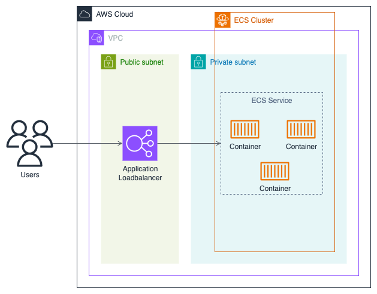
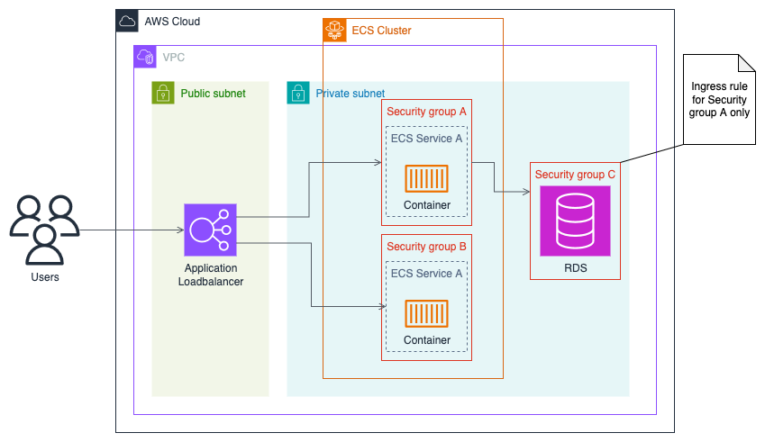

# Terraform ECS

A repository to demo how to setup elastic container service with Terraform.

## Architecture

### Network

Our infrastructure lies in a pretty boilerplate network setup. A set of public
and private subnets spread across 2 availability zones (AZs).

> I've setup for 2 AZs to demonstrate how we spread the infrastructure for
  failover/resilience but for even better resilience we could do this over more
  AZs. Here I've chosen not to as that adds a little more cost such as needing
  to deploy extra resources such as NATs. Also CIDRs split nicely when it's a
  multiple of 2.

When it comes to deploying across multiple regions the same structure is applied
again in each region.

### ECS

ECS runs its containers in private subnets. The loadbalancers to access the
services are public application loadbalancers.

> Note if a service needed to communicate with another this could be done via an
  internal load balancer in a private subnet.

For brevity the following diagram only shows a single region and availability
zone being used but the actual code deploys across multiple regions and AZs.

### RDS

If any service talk to a database such as RDS this would also be placed in a
private with the appropriate security groups to only allow access for the
services that need it.

