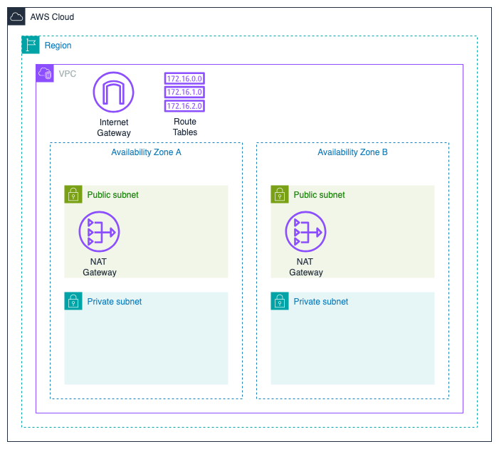

# Terraform ECS

A repository to demo how to setup elastic container service with Terraform.

## Architecture

### Network

Our infrastructure lies in a pretty boilerplate network setup. A set of public
and private subnets spread across 2 availability zones (AZs).

> I've setup for 2 AZs to demonstrate how we spread the infrastructure for
  failover/resilience but for even better resilience we could do this over more
  AZs. Here I've chosen not to as that adds a little more cost such as needing
  to deploy extra resources such as NATs. Also CIDRs split nicely when it's a
  multiple of 2.

