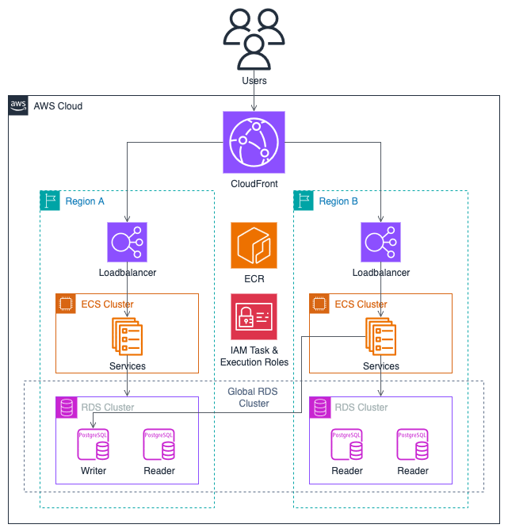

# Terraform ECS

A repository to demo how to setup elastic container service with Terraform.

## Architecture

### Network

Our infrastructure lies in a pretty boilerplate network setup. A set of public
and private subnets spread across 2 availability zones (AZs).

> I've setup for 2 AZs to demonstrate how we spread the infrastructure for
  failover/resilience but for even better resilience we could do this over more
  AZs. Here I've chosen not to as that adds a little more cost such as needing
  to deploy extra resources such as NATs. Also CIDRs split nicely when it's a
  multiple of 2.

When it comes to deploying across multiple regions the same structure is applied
again in each region.

### ECS

ECS runs its containers in private subnets. The loadbalancers to access the
services are public application loadbalancers.

> Note if a service needed to communicate with another this could be done via an
  internal load balancer in a private subnet.

For brevity the following diagram only shows a single region and availability
zone being used but the actual code deploys across multiple regions and AZs.

### RDS

If any service talk to a database such as RDS this would also be placed in a
private with the appropriate security groups to only allow access for the
services that need it.

### Cross Region

The solution is deployed over multiple regions (`eu-west-1` & `us-east-1`).

Since some resources are global (e.g. IAM roles) we need to structure the
Terraform code in a way to elegantly handle that. We want to utilize modules so
we don't repeat code but also have scope to only create some resources once.

To do this there is a main region and a replica region module. The main and
replica modules have then nested modules for resources we repeat across each
region. And the main region module also includes those extra resources shared
across all regions.

